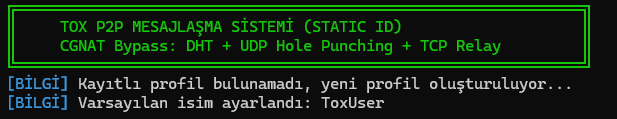
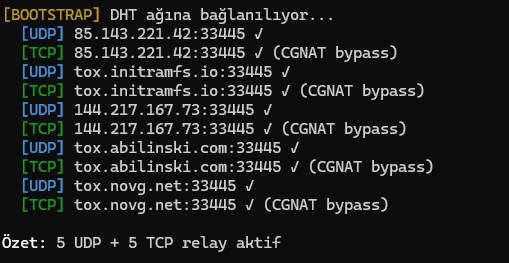
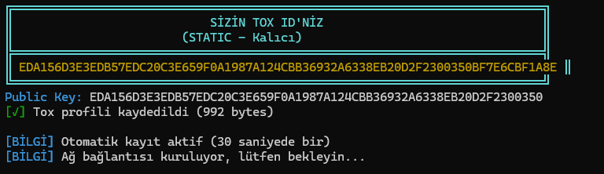
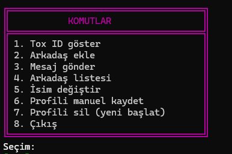

# Project: The Communication

The **Communication** project is a messaging platform based on the **Tox** P2P system. It is a **decentralized** command-line interface (CLI) program that allows messaging without any central server (except for DHT and TCP relay nodes).

---

### Key Features

* **Decentralized**: Apart from relay nodes, it is completely peer-to-peer. Relay nodes only serve to forward messages — they cannot store or read any data.

* **Privacy and Security (Encryption)**: Thanks to the power of Tox, all messages are secured using **Curve25519** and **XSalsa20** encryption. Neither The Communication nor relay nodes can ever see your messages, ensuring maximum privacy.

* **CLI Interface**: Features a simple, clean, and modern command-line interface. Future versions will include a graphical user interface (GUI).

---

### Usage

To use the program, first run the `toxmessenger.exe` file.
When the command-line window opens, it will load your profile if one exists; otherwise, it will create a new one.
It then connects to the bootstrap nodes. Currently, there are 5 UDP and TCP relay servers:

* 85.143.221.42:33445
* tox.initramfs.io:33445
* 144.217.167.73:33445
* tox.abilinski.com:33445
* tox.novg.net:33445

The program will show a short summary and display your permanent Tox ID.

Finally, it lists the available commands and gives control to the user.
To execute a command, simply type its corresponding number.

---

### Commands and Functions

#### 1 (Show Tox ID)

Displays your Tox ID.

#### 2 (Add Friend)

Enter the permanent ID of the user you want to add, followed by a message to send with the friend request.
If the target user is online, the request will be sent; if offline, it cannot be delivered.

#### 3 (Send Message)

Prompts for the friend number of an already-added contact.
Enter the message text to send.
If the contact is online, the message is sent (speed may vary depending on your internet connection).
If offline, the message cannot be sent.

#### 4 (Friend List)

Lists all friend requests that have been sent.

#### 5 (Change Name)

Sets a new username.

#### 6 (Manually Save Profile)

Saves the current profile manually.

#### 7 (Delete Profile)

Deletes the current profile and exits the program.
When restarted, a new profile will be created.

#### 8 (Exit)

Closes the program.

---

### Building

Before compiling, you need to install **MSYS2**.
Go to [MSYS2](https://www.msys2.org), download the appropriate version for your system, and install it.
Then launch the **MSYS2 Mingw64** terminal (the blue icon) and run:

```shell
pacman -S mingw-w64-x86_64-gcc \
          mingw-w64-x86_64-cmake \
          mingw-w64-x86_64-make \
          mingw-w64-x86_64-pkg-config \
          mingw-w64-x86_64-libsodium \
          mingw-w64-x86_64-opus \
          mingw-w64-x86_64-libvpx \
          git \
          make
```

Next, compile **C-toxcore**:

```shell
cd ~
git clone https://github.com/TokTok/c-toxcore.git
cd c-toxcore

# Initialize submodules
git submodule update --init --recursive

# Create build directory
mkdir build && cd build

# Configure CMake
cmake .. -G "MinGW Makefiles" \
         -DCMAKE_BUILD_TYPE=Release \
         -DCMAKE_INSTALL_PREFIX=/mingw64

# Compile (using 4 threads)
mingw32-make -j4

# Install
mingw32-make install
```

To build the system itself:

```shell
# Go to the build folder
cd build

# Configure build files
cmake .. -G "MinGW Makefiles" -DCMAKE_BUILD_TYPE=Release

# Compile using 4 threads
mingw32-make -j4
```

In the project directory, there is a `libs` folder containing the required `.dll` libraries.
Make sure to copy these DLLs into the same directory as `toxmessenger.exe`.

Now the program is fully compiled and ready to use.

---

### Screenshots





